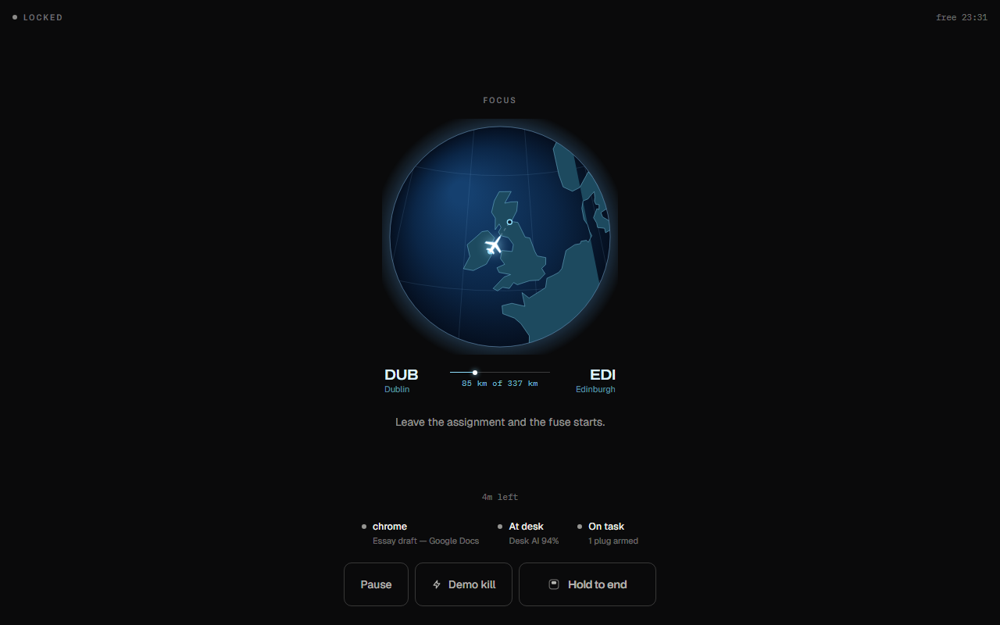

# FocusPlug

**A focus timer that makes you keep it.** Start a session, and if you drift to Discord or a game, FocusPlug force-quits it.

> [!IMPORTANT]
> **Windows 10 and 11 only.** Watching the active window and force-quitting apps both use Windows APIs. On macOS or Linux the app starts, but it cannot enforce anything.



## Try it

**You need:** Windows 10 or 11, [Git](https://git-scm.com/download/win), [Node.js 22.12 or newer](https://nodejs.org/), and a webcam (optional).

**1. Download and install.** Open PowerShell or Command Prompt and run these one at a time:

```bash
git clone https://github.com/sahibsinghCS/FocusPlug.git
```

```bash
cd FocusPlug
```

```bash
npm install
```

**2. Start the app.**

```bash
npm run dev
```

The FocusPlug window opens. Nothing is enforced until you start a session.

**3. Let it use the camera.** Go to Windows Settings → Privacy & security → Camera and turn on *Let desktop apps access your camera*. Open the camera shutter if your laptop has one. Frames never leave your machine. No webcam? In FocusPlug's **Settings**, turn off **Desk AI webcam** and **Strict mode**.

**4. Check your lists.** **Allowlist** holds the apps you study in (Chrome, Docs, VS Code). **Blocklist** holds the apps that get closed (Discord, Steam, games). Both come with defaults.

**5. Start a session.** On **Session**, pick a face and a length, then press and **hold** **Hold to lock**.

**6. Drift on purpose.** Open something on your blocklist. FocusPlug jumps back to the front with a 10-second countdown, then closes the app. Switch back to an allowlisted app before it hits zero and the countdown cancels.

**7. Try a nudge.** **Settings** → **Test phone nudge** or **Test away nudge**, then click into another window. Five seconds later FocusPlug brings itself back to the front.

**8. End the session.** Press and hold **Hold to end**. To quit the app, close its window or press `Ctrl+C` in the terminal.

**Optional: the trained desk model.** **Settings** → **Desk model** → **Custom**. This turns on the model we trained, which can tell when you've left the desk. With it, walking away for 15 seconds stops the clock until you come back.

**No Windows? Try the browser demo.** Run `npm run demo:dev` and open http://localhost:5190. It runs the real forecast model on a scripted study session, in any browser, with no network requests.

## What it does

Most focus timers only count. They can't see that you switched to Discord or left your chair, so they're easy to ignore. FocusPlug adds a consequence.

You list the apps you study in and the apps that distract you, set a length, and lock in. While the session runs, FocusPlug watches two things: which window is in front, and whether you're still at your desk. If you drift, it gives you ten seconds to come back. If you don't, it force-quits the distracting app. It never touches the apps you study in.

After each round it records how many minutes you lasted before your first drift, and it suggests how long your next block should be.

## How it works

Everything runs on your computer. There's no cloud API and no network call when a model makes a decision.

- **Window sensor.** Checks the foreground app's process name and title against your two lists.
- **Desk AI.** MediaPipe BlazeFace reads the webcam and decides whether you're *at desk*, *away*, or *uncertain*. FocusPlug never starts a countdown when the answer is uncertain. The optional custom model scores 95.16% on held-out images. It also has a phone and looking-away head, which is still weak, so it only nudges you ([details](docs/CUSTOM-MODEL.md)).
- **Focus Forecast.** A small neural network (937 parameters) looks at your recent behaviour once a second, including tab switching and time spent in borderline apps, and predicts whether you'll drift in the next 30 seconds. At 50% risk it nudges you. At 65% it cuts the next countdown in half before you've broken any rule. *It was trained and evaluated on simulated sessions, not real students* ([details](docs/FORECAST.md)).
- **Adaptive fuse.** A per-install model learns how long *you* usually need to get back on task, and adjusts the countdown to match ([how the two fuse models combine](docs/RECONCILIATION.md)).
- **Focus Plan.** Estimates how long you can focus before drifting, and treats rounds with no drift as "at least this long" instead of throwing them out. It won't claim you're improving until seven statistical checks pass. It never enforces anything ([details](docs/FOCUS-PLAN.md)).
- **Correction loop.** When the camera pauses your clock by mistake, tap **I was working**. The clock resumes right away. Over time those corrections can refit a personal model, but it's only installed if it beats the shipped one on the same test set ([details](docs/CORRECTION-LOOP.md)).

Built with Electron, React, and TypeScript. MIT license. AI tools used to build it are listed in [docs/AI-DISCLOSURE.md](docs/AI-DISCLOSURE.md).

## For developers

```bash
npm test
```

`npm run typecheck`, `npm run test:kill`, and `npm run test:window` cover the rest. Model pipelines and frozen contracts are in [docs/](docs/). Smart plugs are an optional extra: [docs/SMART-PLUGS.md](docs/SMART-PLUGS.md).
