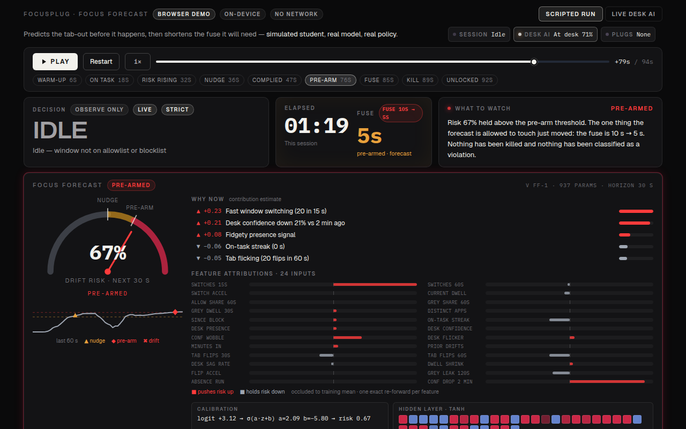

# FocusPlug

**A focus timer that can actually make you keep it.** Pick how the time should look — a flight crossing a globe, an hourglass, a bonsai, a candle, a transit line, a sunrise garden, a leaking flask, a watch movement, or a plain readout — set how long, and hold the switch. While the session runs FocusPlug watches the foreground window and, through an on-device AI, whether you are still in the chair. A second on-device model watches the shape of your behaviour and calls the drift *before* it happens: it warns you, and it shortens the fuse. Drift anyway and it force-quits Discord and the games. Walk away and — on the desk model we trained — it stops the clock rather than counting a room you are not in. Afterwards it tells you how many minutes you held before your first drift, and refuses to call that a trend until it can.

> Every other focus timer asks you to keep the promise. This one keeps it for you. Never kills the study PC.

## Try it on your computer

FocusPlug is a Windows desktop app. There is no installer yet — you run it from source, which takes about five minutes.

**You need:** Windows 10 or 11, [Git](https://git-scm.com/download/win), [Node.js 22.12 or newer](https://nodejs.org/), and a webcam if you want Desk AI.

1. **Download and install.** In a terminal:
   ```bash
   git clone https://github.com/sahibsinghCS/FocusPlug.git
   cd FocusPlug
   npm install
   ```
2. **Start it.**
   ```bash
   npm run dev
   ```
   The FocusPlug window opens. Nothing is enforced until you start a session.
3. **Let it use the camera.** Windows Settings → Privacy & security → Camera → turn on *Let desktop apps access your camera*, and open the laptop's camera shutter — a covered camera reads *Uncertain* forever. Frames never leave your machine. FocusPlug skips virtual cameras (DroidCam, OBS) for your real webcam; to force one, start it with `FOCUSPLUG_CAMERA=<part of the camera name>`. No webcam? In FocusPlug's Settings turn off *Desk AI webcam* and *Strict mode*.
4. **Check your lists.** *Allowlist* is what you study in (Chrome, Docs, VS Code). *Blocklist* is what gets cut (Discord, Steam, games). Sensible defaults are already filled in.
5. **Start a session.** On *Session*, pick a face and a length, then press and **hold** *Hold to lock*. Now open something on your blocklist: FocusPlug jumps back in front ("Discord can wait. Just 49 minutes left — keep going.") with a 10-second countdown before it closes the app. Switch back to an allowlisted app before zero and it cancels. Hold *Hold to end* to stop early. Press *Console* in the lock bar to step out of the full-screen face to the live console without ending anything — the session keeps running and stays armed — and *Back to lock mode* to return.
6. **Watch the forecast.** While a round runs, a second model scores the next 30 seconds once a second. Cross 0.50 and it nudges with nothing enforced; cross 0.65 and it **pre-arms** — the next fuse burns half as long, and the kill overlay carries the receipt (`✔ Forecast pre-armed 14 s before this fuse`). Lock mode is deliberately quiet about it: what you see there is the shortened fuse, that receipt, and the `forecast` rows in *Log*. The instrument itself — risk meter, the 24 feature attributions, the `logit → Platt → risk` line — is the browser demo below, and the session console, which is one press of *Console* away from lock mode while the session runs. Both thresholds, and the whole feature, live under *Settings* → *Focus Forecast*.
7. **See a nudge without getting distracted.** *Settings* → *When you drift* → **Test phone nudge** or **Test away nudge**, then click into any other window. Five seconds later FocusPlug pulls itself to the front with your timer.
8. **Walk away and the clock stops — after the force-quit, never instead of it, and only on the model that earned it.** *Settings* → **Stop the clock when you leave** is on out of the box: fifteen unbroken seconds of the camera not seeing you and the study clock stops, and it **stays** stopped until you press *Start the clock again* — time out of the room is not study time. A stopped clock releases the lock the same way the Pause button does, so nothing is enforced and the camera is released while it sits there — which is exactly why it is never allowed to land inside a burning countdown: it waits for the kill, at every Countdown setting, so raising the fuse above fifteen seconds delays the pause rather than cancelling the force-quit. **The pause needs `deskModelId: "custom"`, so on a default install it never fires.** Default BlazeFace is a face detector with no `away` class — it answers `away` for any frame it cannot find a face in, right 42.1% of the time against the trained head's 92.5% — so on it leaving the room nudges (window to the front, a line on screen) and nothing more; Settings says so on the card. Stopping the clock because the camera saw a **phone** is the same idea behind a much weaker model again, so it ships **off** even there; the numbers that decide both are in [docs/CUSTOM-MODEL.md](docs/CUSTOM-MODEL.md) and the rule is spelled out in [docs/CONTRACTS.md](docs/CONTRACTS.md#drift-pause). Test nudges never stop the clock.
9. **Optional — the trained desk model.** *Settings* → *Desk model* → **Custom** swaps BlazeFace for the trained presence model plus the phone / looking-away head. It reads about once a second on a CPU, and phone detection is experimental: [docs/CUSTOM-MODEL.md](docs/CUSTOM-MODEL.md).
10. **Optional, and no part of the pitch — a smart plug.** Add a Kasa or Tapo plug by LAN IP on *Plugs* and with *Lamp on* (the default) it switches on when you drift, including when you leave the desk; the study PC is hard-denied and the app boots with no plugs at all. Everything above works without one. Setup: [docs/SMART-PLUGS.md](docs/SMART-PLUGS.md).

Homework is open. Discord is where the session actually happens. Students know the pattern: a Docs tab for the screenshot, a game or chat client for the hours. Ordinary focus apps lose that fight because all they do is count. They cannot see that you tabbed to Discord. They cannot see that you left the chair. After a week the ding is just another notification to dismiss.

FocusPlug keeps the timer and adds the part that was missing: consequences.

You open the panel, choose a face from nine live previews running side by side, set the length, and hold the switch to enter **lock mode**. Rounds and breaks are there if you want them — presets for 25/5, 50/10 and 15/3, or your own numbers — but the default is one unbroken block, and a ribbon only appears once there is more than one round to draw.

You allowlist the assignment — Chrome, Google Docs, Word, VS Code, Notion — and blocklist the usual leaks: Discord, Steam, Epic, common games. While a focus round runs, two sensors decide whether you are still on the work. On a break the lock lifts on its own and everything is handed back, which is what makes the next round bearable.

The first sensor is the focused window: process name and title, matched against those lists. The second is Desk AI — an on-device MediaPipe BlazeFace model on the webcam. It emits `at_desk`, `away`, or `uncertain` with a confidence score. Frames stay on the machine. No cloud vision API. Uncertain is a first-class label: the policy will not start a desk-only kill on a maybe.

That presence signal is load-bearing, not a dashboard widget. Session off is observe-only. Session on plus a blocked window starts a ten-second fuse, then FocusPlug force-quits the blocked process. High-confidence desk-away starts the same fuse and kills running blocklist apps even if Discord is only in the background. Return to an allowlisted window while you are actually at the desk and the session unlocks; recover before zero and the countdown cancels. Default strict mode will not call you **On task** unless both the window and the body are on the assignment.

The default face is **Flight**. Your session becomes a real one: a fifty-minute block is Dubai to Doha, two hours is Shanghai to Hong Kong, and the aircraft lands the moment you are done. The route is picked by matching the great-circle block time to the length you set, out of sixty real airports, and it is the same route every time for a given length. The globe is drawn from Natural Earth coastlines bundled into the app and projected on a canvas — no map tiles, no API key, no request leaves the machine, which is the only way a globe belongs in a local-first product.

Lock mode is the whole screen: the face you picked running out, and one quiet line proving the sensors are awake. Drift and the room floods crimson with an opaque kill overlay that names exactly what is about to die. A **Demo Kill** control skips the fuse so a two-minute film can show the consequence without waiting on Discord, and the session log keeps the causal chain. We never tutor. The product is the kill — and the AI is what makes the kill honest when you walk away.

What the session leaves behind is one number. **Focus Plan** records, per round, how many minutes you held before your first drift — using the forecast's own definition of a drift, not a second one — then recommends the next block from it in plain language, and refuses to claim you are improving until seven gates pass. It enforces nothing: no lock, no block, no kill, no button on the overlay, and a test that replays a scripted session with a plan recorder that throws on every call asserts the enforcement path comes out byte-identical without it.

**Run (Windows, Node 22.12+):** `git clone https://github.com/sahibsinghCS/FocusPlug.git && cd FocusPlug && npm install && npm run dev`. Live window match and `taskkill` are Win32; Linux can boot the UI. On the demo machine run `npm run probe:golden` first — it drives the real wiring against your focused window and fails loudly if the sensor is dead (it can never kill anything). `npm run probe:window:live` shows the raw sensor as you alt-tab; `npm run test:kill` performs a real `taskkill` on a harmless stand-in. Film the two-minute take in [docs/DEMO-TODAY.md](docs/DEMO-TODAY.md); the fuller 2–3 min golden path is [docs/DEMO-SCRIPT.md](docs/DEMO-SCRIPT.md) and the five-minute cut is [docs/DEMO-5MIN.md](docs/DEMO-5MIN.md). None of the three needs hardware. Paste AI tools into Devpost from [docs/AI-DISCLOSURE.md](docs/AI-DISCLOSURE.md). Electron + React + Tailwind. MIT. Hyperbloom September (due 14 Sep 2026, 5:00pm EDT).

## The AI that is actually in it

Four models decide things here, and every one of them runs on this machine. Nothing is a wrapper around a hosted API; there is no network call on any inference path.

### 1. Focus Forecast — *is a drift coming?*

A **937-parameter tanh MLP** (`mlp24-36-1`: 24 behavioral features → 36 hidden units → 1 logit, Platt-calibrated) in [`src/shared/forecast/weights.json`](src/shared/forecast/weights.json). It scores P(drift onset within 30 s) once a second off a local telemetry ring — window churn, grey-app occupancy, desk-confidence sag, dwell shrink — and drives two thresholds: **nudge at 0.50** (a toast, nothing enforced) and **pre-arm at 0.65** (the next fuse is shortened before any rule has been broken).

Held out on a disjoint 900-session / 1 230-onset / 1 581 863-frame corpus that no model in the bake-off has ever seen ([`eval-report.json`](src/shared/forecast/eval-report.json)):

| Measure | Value |
| --- | --- |
| Lead-censored AUC (onsets ≥ 20 s away) | **0.9330** against the gate baseline's 0.9259 — margin +0.0071, 95% CI [+0.0035, +0.0107], p = 0.0005 |
| ROC-AUC / PR-AUC (base rate 2.33%) | 0.9510 / 0.6311 |
| Calibration error (ECE) | 0.0038 |
| Warned before the drift (recall@30 s, nudge-or-higher) | 70.8%, at 2.28 nudges/hour |
| Fuse actually shortened (recall@30 s, pre-arm) | 57.5%, at 0.42 false pre-arms/hour |
| Median lead time | 16 s (p25 11 s) |

The gate baseline is the strongest 24-feature multivariate logistic regression on the *same* features — the model a judge means by "did you try logistic regression?" — and the build fails the moment it wins. Seventeen contenders with paired confidence intervals are published in [`bake-off-power.json`](src/shared/forecast/bake-off-power.json).

**Disclosure: the forecast is trained and evaluated on SIMULATED sessions.** Both corpora come from `scripts/forecast/simulate.ts`, a hazard-driven behaviour simulator; no student data was collected, bought or scraped. Those numbers measure the model against the simulator's world, and the simulator encodes our assumptions about how a drift begins. Everything else about them is real: the eval corpus lives in a disjoint seed namespace with three published contamination barriers, and every interval is a session-clustered bootstrap.

### 2. The adaptive fuse — *how long does THIS person need?*

`src/main/session/adaptiveFuse.ts` over `src/shared/adapt`: a 17-feature logistic model, learned **online and per install**, that predicts P(you fix this yourself | this moment, a fuse of N seconds) and picks the shortest fuse still clearing `RECOVERY_TARGET` = 0.85. It needs no annotation, because the app already produces its labels — `cancel_countdown` is a recovery and its timing says how long you needed; `kill` is a failure, with longer candidate fuses censored. Weights live in your own user-data dir; nothing is uploaded, and a cold install behaves exactly like the plain Settings fuse until it has seen you drift.

### 3. How those two compose — one number, `countdownSec`

Both models want a say in the fuse and both write the same field, so there is exactly one authority: [`src/main/session/fuseAuthority.ts`](src/main/session/fuseAuthority.ts), pure and four lines long.

```
prearmed ? clamp(round(personal × 0.5), MIN_FUSE_SEC, personal) : personal
```

The adaptive fuse sets a **personalised base length**; the forecast **scales it toward the floor** when it has pre-armed, and never replaces it. A slow recoverer who has earned 20 s still gets 10 s under a pre-arm while a fast one on 8 s gets 4 s — everyone loses the same *fraction* of their fair shot, which `min(personal, 5 s)` would have thrown away. On a fresh install with the default 10 s fuse the arithmetic is the demo beat exactly: **10 s → 5 s**. Two guarantees ride along: a burning countdown never changes length mid-burn (the latch), and the whole computation sits inside one `try` at the kill-path call site, so a model that throws cannot stop enforcement. A pre-armed drift is deliberately **not** learned from — the fuse it was handed is not the fuse the learner chose — and the log says so out loud: `adapt · 5s — forecast pre-armed, scaled from your 10s · not learned from`. The full argument, including the fix that was rejected, is [docs/RECONCILIATION.md](docs/RECONCILIATION.md).

`FOCUSPLUG_NO_ADAPT=1` pins the fuse to the Settings number; switching the forecast off removes the pre-arm. With both off the countdown is exactly `settings.countdownSec`.

### 4. The desk models — *are you in the chair?*

The default is on-device MediaPipe **BlazeFace** plus occlusion heuristics (`deskModelId: "blazeface"`). `deskModelId: "custom"` is not a placeholder — it selects a **desk head trained in this repo**: BlazeFace over four crops, a MobileNetV2 scene vector and hand-crafted luma / colour / gradient descriptors into a 64-32 MLP. **95.16% held-out 3-way accuracy** against 46.89% for the heuristic baseline, weights committed, training images never. Read the caveats before quoting it: the Edinburgh slice of that eval shares a camera with its training split (the diverse-scene figure is 89.44%), and the eval imagery is 3rd-person stock while your webcam is 1st-person.

Riding on the same feature vector is a second, **Adaption-Labs-labelled attention head** (`focused` / `unfocused` / `phone`), consulted only when presence says `at_desk`; it is what lets a phone or a long look away raise a nudge. Its labels came from Adaption Labs' Adaptive Data annotating 1,919 desk photos with one fixed instruction. **It is not reliable yet, and we do not claim phone detection.** On the original 143-image eval the first head scored **56.6%** and the shipped head scores 60.8% — both *below* the **65.7%** you get by always answering `focused`. On the current 200-image eval it reaches 64.0% (phone F1 68.5%) against a 48.5% baseline, but it also calls "phone" on non-phone photos about 17% of the time. Claim the pipeline, not the detector. Numbers, splits and the labelling protocol: [docs/CUSTOM-MODEL.md](docs/CUSTOM-MODEL.md).

Those numbers decide what the head is allowed to do. It nudges, and by default that is all it does: stopping the study clock on a `phone` call is a switch you turn on, while stopping it when you **walk away** rides the far more reliable presence head and is on out of the box. 225 free-licensed stock photographs were collected against its known failure modes — heads down over notebooks, phones low in frame — split 132 train / 93 eval, and **training** on the 126 labelled train images made the head **worse**: nearly eight points of mean 3-way accuracy across five seeds, with no reduction in false `phone` calls on the hard negatives. So nothing ships from them, and the shipped head is the same bytes it was; what they did buy is a harder 86-image held-out set the head is now measured on, where it scores 57.0% against an always-`focused` baseline of 83.7%. The rows, their credits and the negative result are all committed so anyone can re-run it.

Dropping in a model of your own means replacing `src/main/desk/model/your-model.ts` or adding a fourth factory id — both routes, and what each costs, are in [docs/MODEL-SEAM.md](docs/MODEL-SEAM.md).

### 5. Focus Plan — *how long can you actually hold, and is it improving?*

Not a fifth model, and it decides nothing — that is the point. The forecast knows *when* you are about to drift; **Focus Plan** turns that into a plan recommended before the round with its reasoning in plain language, a debrief after it, and one tracked headline metric: **minutes until your first drift**. It reuses the forecast's own drift definition verbatim (`isDriftedDecision`, `findDriftOnsets`, `DRIFT_DEBOUNCE_SEC`) rather than inventing a second one, and `src/shared/plan/drift.test.ts` pins the two together so a divergence is a failing test rather than a promise.

**It never enforces.** No lock, no block, no kill, no button on the nudge overlay. The process kill remains the only enforcement in this product, and Focus Plan has no seam into it: `SessionControllerOptions` gains no plan-shaped key, `adaptiveFuse.ts` is untouched, and `src/main/focusplan/integration.test.ts` runs a scripted session with a recorder that **throws on every single call** and asserts the policy events, states, kill calls and log come out byte-identical to the committed golden path. A break is an offer that helps you avoid the kill.

The estimator is **Kaplan–Meier**, because the data is censored: a round that ran clean is not a hold of exactly its length, it is an observation whose true value lies somewhere *past* it. Treating those the same biases the number downward exactly on your good rounds. KM also refuses on its own — when the curve never reaches a half the median is undefined, and the card then says "at least X" instead of inventing a point estimate.

Three honesty rules it is built around, all of them load-bearing:

- **It says something true on a fresh install.** A six-rung cold-start ladder means there is no empty state anywhere in this feature. With zero history the card reads *"Start with 25 minutes, then 5 off"* and says outright that this is the pomodoro default and not a reading of you. Inside the very first round it can fall back to the live risk curve, and it labels that read **provisional**.
- **It refuses to draw a line through two points.** The trend has **seven gates** — enough drifts, across enough distinct days, balanced halves, not too censored, a change beating your own spread, a robust slope agreeing in sign, and a leave-one-out sweep that drops each round *and each day* in turn. `slopeMinPerRound` is structurally `null` unless every one passes, and the copy names the gate that stopped it.
- **It is fully overridable.** The Dial below the card stays editable, the button only writes the plan, and acceptance is *measured* rather than trusted — it compares the block actually armed against the length recommended.

`npm run gauntlet:plan` replays 400 simulated students, 24 rounds each, against a fixed 25/5:

| | Focus Plan | fixed 25/5 |
| --- | --- | --- |
| Rounds finished without a drift (stationary students) | **14.2 / 24** | 11.2 / 24 |
| Focus minutes served (stationary students) | 516 | **523** |
| Rounds finished without a drift (improving students) | **19.8 / 24** | 17.2 / 24 |
| Focus minutes served (improving students) | **581** | 573 |

The second row is the trade, printed rather than hidden: planning to a student's measured limit buys 3 more clean rounds out of 24 and costs about 7 focus minutes across the whole run, because a shorter block that finishes is sometimes a shorter block. For a student who is actually improving the trade disappears — more clean rounds *and* more minutes.

Censoring is earning its place: median absolute error of the estimate is **0.95 min** with Kaplan–Meier against **1.87 min** if clean rounds are counted as drifts. And the gate that actually fails the build — on a **stationary** population, where there is no trend to find, the seven gates report `clear` in **3.8%** of runs, under the 5% bar. A trend detector that finds trends in noise is worse than no trend detector.

**Disclosure: that table is a simulation against simulated students, not a user study.** The per-install measurement is the real claim, and it has no number until it has watched you work. Everything is on-device in `<userData>/focus-plan.json`, which holds durations and drift offsets — no process name, no window title, no frame, structurally, because the plan's tap never subscribes to those channels. `focusPlanEnabled: false` reproduces today's screens exactly; `FOCUSPLUG_NO_PLAN=1` is the filming pin — the cards stay up on the cold-start rung for one run while the ledger is left untouched, exactly as `FOCUSPLUG_NO_ADAPT=1` leaves you a fuse and pins it to the Settings number. Full design: [docs/FOCUS-PLAN.md](docs/FOCUS-PLAN.md).

There is one way to put numbers on that card that you did not earn, and it is built to be impossible to hide. `npm run demo:seed` writes a fabricated multi-day ledger — fixture rounds from `src/shared/plan/fixtures.ts`, slid onto real days — so the card has something to read while a demo is being filmed. The ledger it writes carries a `seed` stamp the recorder itself can never write, `reviveLedger` keeps it and `appendRound` carries it through every later rewrite, and `PlanRecorder` prints it into the app's own **Log** under the *Focus Plan* filter: `SEEDED DEMO HISTORY · 3 fabricated rounds written by npm run demo:seed …`, at start-up and again for each round armed on top of it. So a seeded history cannot quietly age into measurement, and `npm run demo:unseed` restores whatever was there before — refusing outright to remove a ledger that carries no stamp. Argued in [docs/FOCUS-PLAN.md § 5.1](docs/FOCUS-PLAN.md); the filming procedure that uses it, disclosure sentence included, is [docs/DEMO-TODAY.md](docs/DEMO-TODAY.md).

## Try it in the browser

`npm run demo:build` writes a static page to `dist/demo`. Open `dist/demo/index.html` directly — it is one HTML file and one classic script with the fonts and model weights inlined, so it runs from `file://`, from `python3 -m http.server`, or from GitHub Pages without configuration (`base` is `./`, no module scripts, no sibling fetches). `npm run demo:dev` serves the same page from source on port 5190. It needs neither Windows nor an Electron install, and it makes no network requests at all.

The page runs the shipped Focus Forecast against a simulated study session: a scripted stream of window-focus and desk events — writing in Docs, then tab flicking and grey-app loiter, then Discord — feeds the real telemetry ring, the real feature extractor, the real trained `weights.json`, the real escalation reducer and the real `src/shared/policy` engine, in that order, in the tab. The student is the only fabricated part; there is no place in the code to put a canned risk number. The arc is 94 seconds at 1x (there is a 2x toggle, a scrub bar and chapter marks): the risk meter climbs with its 24 feature attributions and the `logit → Platt → risk` line visible, a nudge fires with no enforcement, the student complies and the needle decays, a harder ramp earns a pre-arm that shortens the fuse from 10 s to 5 s before any violation exists, the policy engine classifies Discord and burns that shortened fuse, the kill overlay carries the lead-time receipt, and returning to the assignment unlocks the session. The beat timings are not scripted — they are wherever the shipped 937-parameter net actually fires on that stream, which is why swapping the model moves them.

**A browser tab cannot force-quit a process.** What the page shows at the end is the policy engine's kill decision and its targets; the Windows app is what executes them. The page says so in its own footer.

An optional second mode swaps the scripted desk sensor for your webcam and runs the app's own MediaPipe BlazeFace graph on-device (the weights are inlined in the bundle, so this is still offline). Cover the lens or leave the frame and presence drops, strict mode stops calling you on task, Decision flips to Away and the same policy fuse starts. It is opt-in and fails soft: a declined permission, a missing camera, or a `file://` page — which cannot ask for one — leaves the scripted run untouched and prints why. Use `http://localhost` or https for this mode.

`npm run demo:verify` is that page's gauntlet: typecheck, the timeline's own tests, a production build, then headless Chromium against the built output asserting that the beats render, that nothing is requested off-origin (including the BlazeFace weights), that there are no console errors, that the page does not scroll horizontally at 900 px, that `file://` boots, and that the webcam mode initialises the model and drives a real countdown. Legibility is measured rather than assumed: the `logit → σ(a·z+b) → risk` readout must render end to end and sit inside the 800 px frame in every scene that shows the panel, and no text anywhere on the page may be clipped by its own overflow at 1280 px or 900 px — a `title` attribute is not a defence, because nobody hovers a screenshot. It writes the stills in [demo/evidence](demo/evidence).



## The app, as it renders

Stills below are the real UI on seeded mock-IPC state (`npm run preview:renderer`, then `npm run stills:readme`), not a live session. The film in [docs/DEMO-SCRIPT.md](docs/DEMO-SCRIPT.md) is the live run.


## Verify

Nothing here needs Windows except the live window match and `taskkill`.

```
npm ci
npm run typecheck    # contracts check + three tsconfigs
npm test             # the vitest suite
npm run test:kill    # node --test: real tasklist / taskkill against a harmless stand-in (Windows)
npm run test:window  # node --test: window matcher, monitor, and the Win32 foreground script
```

Typecheck and the vitest suite take about twenty seconds together on a four-core Linux box (`npm ci` depends on your npm cache). `npm run typecheck` starts with `npm run check:contracts`, which byte-compares every file a doc publishes as complete source against that file — `src/shared/types.ts` against the frozen Types fence in [docs/CONTRACTS.md](docs/CONTRACTS.md), and `src/shared/plan/types.ts` and `src/shared/plan/constants.ts` against the frozen appendix in [docs/FOCUS-PLAN.md](docs/FOCUS-PLAN.md) — so the contract docs cannot drift from the code in silence.

Then the per-model gauntlets, each of which prints its own numbers:

```
npm run test:forecast   # forecast: telemetry ring, features, weights, escalation, main-process tap
npm run test:desk       # desk-vision fixture gauntlet, including the missing-weights fallback
npm run gauntlet:adapt  # adaptive fuse: 77.5% recovered at 8.4 s waited, vs the constant fuse's 69.4% at 9.4 s
npm run demo:verify     # the browser demo, end to end in headless Chromium
```

`npm run forecast:pipeline` retrains the shipped forecast model from nothing — simulate, build the dataset, build the disjoint 900-session evaluation corpus, train, score against the CI gate. About 7.5 min, fully offline, no keys or accounts, deterministic under `--seed` (default 42). It rewrites `src/shared/forecast/weights.json` and `eval-report.json` in place; on the same seed every weight and every metric comes back identical, and only the timestamps and provenance hashes move.

The `gauntlet:adapt` figure is a **simulation against simulated students** — its fitted prior comes from 9,600 sampled drifts (`datasets/focusplug-drifts.csv`), not from people. The per-install model is the real claim, and it has no number until it has watched you drift.

Stills and smoke helpers each start their own preview server and need a Chrome or Chromium on the box (`CHROME_PATH=/path/to/chrome` if it is off the standard paths):

```
npm run preview:renderer      # the renderer alone on 127.0.0.1:5173, mock IPC, seeded ?scene= states
npm run stills:readme         # the five stills above (needs preview:renderer in another terminal)
npm run session:stills        # setup / on-task / away / pre-armed / fuse-overlay stills
npm run console:stills        # every route of the shell, for UI review
npm run smoke:session-actions # holds the switch for real: plan → lock → Console → live console, Demo Kill, the fuse overlay
```

Evidence sits next to the thing it proves: [`src/shared/forecast/eval-report.json`](src/shared/forecast/eval-report.json) and [`bake-off-power.json`](src/shared/forecast/bake-off-power.json), [`demo/evidence`](demo/evidence), [`src/renderer/src/features/forecast/evidence`](src/renderer/src/features/forecast/evidence), [`src/main/desk/model/weights/attention-head.metrics.json`](src/main/desk/model/weights/attention-head.metrics.json), and `docs/screenshots/`.

Model and contract docs: [FORECAST.md](docs/FORECAST.md) (pipeline, every metric, provenance), [FORECAST-DESIGN.md](docs/FORECAST-DESIGN.md) (model, telemetry, labels, training, policy integration, cut lines), [FORECAST-CONTRACTS.md](docs/FORECAST-CONTRACTS.md) (frozen forecast types and settings), [CUSTOM-MODEL.md](docs/CUSTOM-MODEL.md) (the trained desk head and the attention head), [MODEL-SEAM.md](docs/MODEL-SEAM.md) (dropping in your own desk model), [RECONCILIATION.md](docs/RECONCILIATION.md) (how the two fuse models compose), [CONTRACTS.md](docs/CONTRACTS.md) (frozen app types), [AI-DISCLOSURE.md](docs/AI-DISCLOSURE.md) (every model and every build-time assistant, with the caveats attached).
