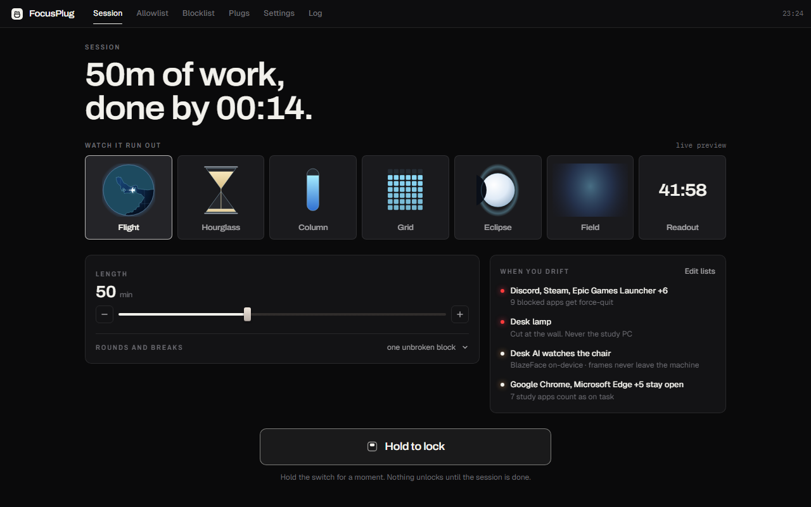
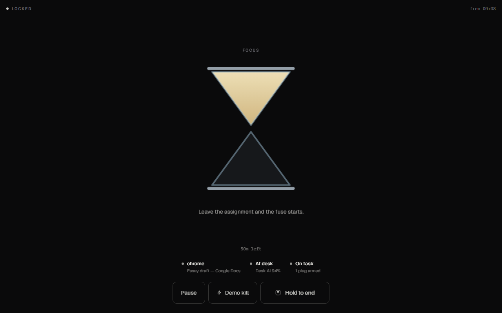

# FocusPlug demo script (2–3 min)

**Target: 2:45. Band: 2:00–3:00.** One take, Windows desktop, webcam on. Film the **enforcement**, not the countdown. The five-minute cut, with the model minute and the caveats spoken out loud, is [DEMO-5MIN.md](DEMO-5MIN.md); everything in this file's *Hard fails* section applies there too.

> **Filming today, against the 2026-09-14 deadline?** [DEMO-TODAY.md](DEMO-TODAY.md) is the same story cut to about two minutes with no dead air, beat by beat, and it is the only one of the three that tells you how to get a plan card worth filming on a clean machine. This file stays the source of truth for the kill beats and the *Hard fails* below; DEMO-TODAY does not repeat them.

Say this once, out loud, before record: *“Every other focus timer asks you to keep it. FocusPlug sees the drift coming, warns me, shortens the fuse, kills the distraction, stops the clock when I walk away — and afterwards tells me how long I actually held.”*

**Nothing in this film needs hardware.** Every beat below is the app on one Windows PC and its own models. Smart plugs still ship and still work; they are an optional aside at the end of this file, and they are not part of the take.

Do **not** say: streak, gentle reminder, productivity coach, tutor. Never pitch the countdown on its own — always land the consequence in the same breath. “Nudge” is a real product word here (the forecast raises one), so use it only for that.

## Pre-flight (not on camera)

1. Discord installed and signed in. Google Docs open in Chrome (`docs.google.com` in the title). Two or three unlisted windows to flick between for the forecast beat — File Explorer, Notepad, a settings window; anything on neither list.
2. `npm run probe:golden` — 10 seconds, no GUI, kills nothing. It must print **GOLDEN PATH PROBE: PASS**; if the window sensor is dead on this machine, everything below is unfilmable.
3. `npm run dev` (or a packaged build — not `npm start` against a stale `out/`). Confirm the UI is live IPC, not a stuck mock: the sensor line in lock mode must name your real window once a round is running.
4. **Settings:** Countdown **10s**, Strict mode **on**, Desk AI webcam **on**, desk threshold default (~60%), **Focus Forecast on**, **Pre-arm on**, nudge 50%, pre-arm 65%.
   **Decide about *Stop the clock when you leave* before you roll — and check which desk model you are on.** The switch is **on** by default, but the away pause also needs `deskModelId: "custom"`: on the shipped BlazeFace detector it is inert by design, because that detector answers `away` for any frame with no usable face and is right 42.1% of the time (`docs/CUSTOM-MODEL.md § Away, on the model that actually ships`), and Settings shows a card saying so. **On the default model the clock does not stop, so do not promise that it will.** On the custom model the away beat below is fifteen seconds of away — exactly the pause threshold — and the take gains a real beat (the clock stops, the lock releases, the screen says why, and you press *Start the clock again*); say so on camera, because a timer that stops without a word looks broken on video. Turn the switch off if you want the away beat to be about the kill and nothing else. Either is fine; being surprised by it mid-take is not.
5. **Pin the fuse, or the take is a coin flip.** Two models decide the fuse length. The adaptive fuse hands out a longer probe fuse on a fraction of early drifts, so the overlay can read **30** while you are saying “ten-second fuse”; the forecast then scales whatever that personal length is by half. For a scripted take, pin the personal length to the Settings number:

   ```
   rem cmd.exe — two lines, and never paste a # comment into cmd
   set FOCUSPLUG_NO_ADAPT=1
   npm run dev
   ```

   ```powershell
   $env:FOCUSPLUG_NO_ADAPT = "1"; npm run dev
   ```

   ```bash
   FOCUSPLUG_NO_ADAPT=1 npm run dev
   ```

   Pinned, the beat is exactly **10 s, or 5 s if the forecast pre-armed** — the two numbers you can safely say out loud. Unpinned you get the stronger AI story — say “the fuse is learned, not fixed” and read the number off the overlay instead of scripting it.
6. **Lists.** *Allowlist* includes Chrome / Google Docs. *Blocklist* includes Discord.
7. On the **Session** panel leave the **Flight** face selected (nine faces preview live there; the Settings grid writes the same setting), set the length to 15 minutes so the film fits, hold the switch into lock mode, and sit in frame until the sensor line reads **At desk** with a real confidence (not 0%). Sensors read **Standby** until a round is running. Hold **End** to come back out before you record.
8. Rehearse the forecast beat once (§ *The forecast beat*, below) and note how much window-flicking it takes before the fuse opens on 5 instead of 10. Close extra windows. Hide this script. Have **Demo Kill** ready as the rescue path for any beat that stalls — it lives in the lock-mode controls, and on the overlay as *Demo Kill — skip wait*.

If Discord cannot launch, skip to the Demo Kill beat and say you are showing the fuse and the instant kill path. Still open **Log** for two seconds so the timeline is on film.

The Log page **90s path** panel is a cheat sheet of this script (same product labels). Do not read it aloud — point at Kill / Unlock rows if a judge asks where the proof lives.

## The forecast beat — read this before you rehearse, it is the one beat that can bite

The Focus Forecast scores P(drift in the next 30 s) once a second from real telemetry: how fast you are switching windows, how long you loiter in apps on neither list, how your desk confidence is sagging. **You cannot script when it fires**, and **lock mode does not draw the meter.** Two facts to plan the shot around:

- *In the app*, a pre-arm shows up as a **shorter fuse** — the overlay opens on 5, not 10 — plus the amber receipt line on that overlay and `forecast` rows in **Log**. That is the beat you film live, and it is the honest one: the consequence, not the dial.
- *The instrument* — risk meter, the 24 feature attributions, the nudge toast, the `10s → 5s` plate — lives on the browser page and on the forecast preview, because the full-screen lock deliberately keeps one quiet sensor line and nothing else. Cut to it, do not hunt for it under the lock. It is also in the app, one press of **Console** in the lock bar away: the session keeps running and stays armed while it is up, so you can show the live meter mid-round and press **Back to lock mode** to carry on. Filming it costs the full-screen face, which is why the scripted beat still cuts to the browser page.

To earn the pre-arm on camera: leave Docs, flick between the unlisted windows every couple of seconds, lean back out of the frame a little, and keep it up for fifteen to twenty seconds before you open Discord. Median lead in the eval is 16 s, so give it that long. Rehearse until you know roughly how much flicking your machine needs, then do it once on the take and check the overlay number.

If the fuse still opens on 10, **do not fake it and do not cut the beat** — say the honest line and cut to the deterministic run:

> “That is a model with a threshold, not a scripted animation, so it fires when it fires. Here is the same net, same weights, on a recorded session.”

`npm run demo:dev` (or `dist/demo/index.html`, which opens straight from `file://`) plays the shipped weights over a 94-second session with the risk meter, the nudge, the pre-arm, the `10s → 5s` chip and the kill receipt in order. Say plainly that the browser page renders the kill *decision* — a tab cannot force-quit anything.

## Clock

| Time | Beat | On screen | Voice (tight) |
| --- | --- | --- | --- |
| 0:00–0:15 | Problem | Session panel, nothing locked, Docs visible in the background | “Students fake-study with Discord open. A pomodoro counts the minutes and then dings. It doesn’t close the distraction, and it has no idea you left the chair.” |
| 0:15–0:35 | Setup | On **Session**, click along the faces — they all preview live — then drag the length dial and watch the route and the “done by” time follow. Show **Blocklist** (Discord), **Settings** (webcam on, strict on, Focus Forecast on), back to **Session** | “Pick how you want to watch it run out. Mine is a flight — set fifty minutes and that is Dubai to Doha, landing when I am done. Free by ten. Allowlist the assignment, blocklist Discord and the games. All of the AI runs on this machine — frames never leave the PC.” |
| 0:35–0:50 | Arm | Sit in frame. **Hold the switch.** Lock mode takes the screen: the aircraft leaves, sensor line **On task** | “Hold it — and that’s the commitment. Wheels up. Chrome on the assignment, I’m at the desk. Off the clock it only observes; a live round can kill.” |
| 0:50–1:15 | **Forecast** | Flick between the unlisted windows for ~15 s, leaning out of frame. Lock mode stays quiet — that is the point; cut in two seconds of the browser page's meter if you want the dial on film | “Nothing has been broken yet. But a second model is reading the shape of this — how fast I’m switching, how long I’m loitering, my desk confidence sagging — and it is calling the drift before it happens. Watch what that costs me.” |
| 1:15–1:40 | Distracted → kill | Alt-tab to Discord. Opaque overlay: **Killing blocked apps in** `5…` — half the fuse — with the receipt line *✔ Forecast pre-armed N s before this fuse*. HUD chips still name the window, the desk call and the decision. Overlay hits 0; Discord quits | “I tabbed to Discord. Distracted — and because it saw this coming, five seconds instead of ten. That line is the receipt. Go back to the doc and it cancels. I’m not going back.” |
| 1:40–1:55 | Log | Press **Console** in the lock bar (the session keeps running and stays armed), open **Log**: Window → Distracted → **Forecast pre-arm** → **Countdown** → **Kill**, then **Back to lock mode** | “Discord is gone. The log is the proof — sensor, forecast, decision, fuse, kill. Same labels as the overlay.” |
| 1:55–2:10 | Unlock | Alt-tab to Docs, stay in frame. Overlay gone. Decision **On task** | “Back on Docs, still at the desk — unlocked. Strict mode needs both.” |
| 2:10–2:30 | Desk AI (load-bearing) | Re-open Discord in the background if needed, then **cover the webcam** or leave the chair. Decision **Away**. Blocklist apps quit after the fuse; at 15 s the study clock stops too, unless you turned that off in step 4 | “Timers can’t see this. I left the desk — or covered the camera. High-confidence Away kills blocklist apps even if they weren’t focused. Uncertain never kills on desk alone. And fifteen seconds in, it stops counting this as study time — it won’t restart until I say so.” |
| 2:30–2:40 | Demo Kill | Uncover camera. Open Discord again. Click **Demo kill** in the lock-mode controls (or the overlay’s **Demo Kill — skip wait**) | “Demo Kill is for filming: same force-quit, no waiting. Never kills the study PC.” |
| 2:40–2:55 | Close — the number it leaves you | **Skip round** into a break (the screen inverts to black on bone, lock released), then hold **End**: the Session panel returns carrying the debrief for the round you just filmed — how long you held before the first drift, what the fuse and the force-quit cost, and the plan for the next round | “The break hands Discord back on its own. And it measured me the whole time: I held *N* minutes before my first drift — read that off the screen, never script it. One round is a mood, not a pattern, and it says so itself. It sees the drift coming, it knows whether I’m in the chair, the kill makes the timer mean something — and tomorrow it can tell me whether I’m getting better.” |

The debrief is a **live read of the round you just filmed**, so treat it like the forecast beat: whatever number is on that card is the number you say. It renders on the Session panel for thirty minutes after the round and needs `focusPlanEnabled` on (the default) — if it is not there, say the loop instead of a number ("it measures minutes-to-first-drift and refuses to call a trend off one round") and move on. Do not read a seeded still as if it were your take: `npm run plan:stills` renders fixture ledgers, not you.

If the desk-away beat is messy, cut it to 10 seconds (cover lens → **Away** label) and spend the time on Demo Kill. **Do not** skip Desk AI or the forecast entirely — Hyperbloom scores AI/ML as central, not decorative, and those two beats are where it is central.

## What the numbers behind the beat are, if a judge asks

- The pre-arm came from a **937-parameter MLP** scoring 24 behavioural features once a second. Held out on 900 **simulated** sessions: 0.9330 lead-censored AUC against a 0.9259 logistic baseline the build enforces as a gate; 70.8% of drifts warned within 30 s; median lead 16 s. Say *simulated* out loud — the corpus is our own sampler, not students.
- The **10 → 5** is not a constant. The adaptive fuse learns your personal length on-device, and a pre-arm halves whatever that is, floor 3 s: `prearmed ? clamp(round(personal × 0.5), 3, personal) : personal`. Ten becomes five because ten is the default you have not moved yet.
- The **debrief number is not a model output and not a benchmark** — it is a Kaplan-Meier read of your own rounds on this install, censoring the clean ones instead of pretending they drifted at the buzzer. The 400-student table in `docs/FOCUS-PLAN.md` (`npm run gauntlet:plan`) is a **simulation**, and the trend refuses to speak until seven gates pass. Say both halves.
- The desk call is a model we trained **if** you set `deskModelId: "custom"` before filming. On the default you are filming BlazeFace plus heuristics — say so, and show the eval instead of narrating it over the wrong footage. **Lead with 89.44%, the diverse-scene figure**, rather than the 95.16% headline: the Edinburgh slice of that eval shares a camera with its training split, so 89.44% is the number that survives a judge opening `docs/CUSTOM-MODEL.md`. Quote 95.16% only with that caveat in the same breath, the way the README does. Either way the heuristic baseline is 46.89%, and the eval imagery is 3rd-person stock while your webcam is 1st-person.
- The **away pause** is gated on that same trained head for a reason worth saying: it is right on **92.5%** of its `away` calls against BlazeFace's **42.1%**. That asymmetry is the whole argument for why the clock only stops on `deskModelId: "custom"`.
- **Do not claim phone detection.** The attention head (`focused` / `unfocused` / `phone`) scores **57.0%** on the hard held-out set against an always-`focused` baseline of **83.7%** — it does not beat "assume they are working" off-distribution, which is why stopping the clock on a `phone` call ships **off**. Claim the pipeline, never the detector.

## Still captures

`docs/screenshots/` is committed and regenerates from the seeded scenes:

```bash
npm run preview:renderer   # terminal 1 (127.0.0.1:5173)
npm run stills:readme      # terminal 2
```

Those are mock-IPC renders of the real UI — good enough for the README, but **overwrite them with live captures from the take** if the run goes well. Freeze the overlay with `#/?scene=distracted&countdown=8&freeze=1` only for stills, not the live take. For the log still, `#/log?scene=golden` seeds a full causal chain on mock IPC; the live take should use the real log after Discord dies. `npm run session:stills` and `npm run console:stills` render the wider set, including the pre-armed clock — the `10s → 5s` plate and the amber fuse — at `#/?scene=live&freeze=1&fct=52`.

| File | When to grab | Judge should read |
| --- | --- | --- |
| `01-session-panel.png` | Panel before you lock | The commitment is legible: the faces live, the length, the hour you are free |
| `02-lock-flight.png` | Session running, Docs focused, at desk | Enforcement is armed; AI says present |
| `03-kill-overlay.png` | Overlay at ~5 s, Discord focused, receipt line visible | Consequence is unmistakable, it names what dies, and the forecast called it first |
| `04-lock-hourglass.png` | Same session, hourglass face | The face is a choice, not the product |
| `05-session-log.png` | After kill + unlock | Causal timeline: `forecast` → `countdown` → `kill` → `unlock`. Kind/status filters |







## Hard fails (reshoot)

- Overlay is a small toast instead of a full-window takeover
- Countdown stuck and Discord never dies
- You pitch the countdown without the kill in the same breath
- Desk AI stays **At desk** with the lens covered
- Demo Kill no-ops or claims the killer isn’t wired
- Study browser / VS Code / Docs gets killed
- **The overlay reads 30 while you say “ten-second fuse”** — you forgot the pin
- **You narrate a pre-arm that did not fire**, or imply the browser demo force-quit something
- You quote 95.16% without the camera-sharing caveat (89.44% is the safe figure), or the forecast AUC without saying which model / that the corpus is simulated
- **You claim the app can tell you picked up your phone.** The attention head loses to an always-`focused` baseline off-distribution; pause-on-phone ships off for exactly that reason
- You let the clock stop on the away beat and narrate it as enforcement. A drift pause *releases* the lock — it is the app declining to count time you were not there for, not a second lock
- **You promise a clock stop on the away beat while filming the default model.** The away pause needs `deskModelId: "custom"`; on the shipped BlazeFace detector the clock keeps running by design, because that detector is right on 42.1% of its `away` calls against the trained head's 92.5% (`docs/CUSTOM-MODEL.md § Away, on the model that actually ships`)
- **You say a Focus Plan number that did not come off this take** — a seeded still (`plan:stills`, `?scene=plan-measured`) is a fixture ledger, and presenting it as your own session is the one lie that would sink the whole submission. Same rule for a ledger `npm run demo:seed` wrote into the running app: if you seeded, say so in the same breath as the number. This cut does not need a seed — its close beat reads the round you just filmed
- You spend the minute on settings sliders instead of a kill

## Shot order if time is short (2:00 cut)

Problem (10s) → hold-to-lock, On task (10s) → forecast nudge + pre-arm (20s) → Discord overlay at 5 s (20s) → kill (10s) → return unlock (10s) → cover-camera Away (15s) → Demo Kill (10s) → hold End, the debrief and its number + close line (10s). The break beat is the one to drop; the debrief is the last thing a judge should see.

## Optional aside — the smart plug (skip it)

Not in the take, not in the pitch, and safe to leave out entirely: the AI is the claim here, a plug is an actuator, and hardware on camera is a live failure risk a judge cannot verify anyway. It also costs money a student may not have, which is the wrong note for an equity track.

If you want it as a fifteen-second tag *after* the close, film it as its own clip so the edit still works when you drop it:

1. Prove the hardware answers before you roll — `npm run probe:plugs -- --ip <plug-ip>`, then the same with `--off`. Setup, credentials and the mock paths are in [SMART-PLUGS.md](SMART-PLUGS.md).
2. Add it by LAN IP on *Plugs*, switch *Settings* → *Plugs when you drift* to **Cut power**, and hit **Demo Kill** with the lamp in shot.
3. Say what it is: an optional LAN plug on a secondary fun device. Never the study PC — that is hard-denied in code, not a setting.

One thing to know even if you skip all of it: with no plugs configured the kill overlay still carries a **Plugs** chip reading *No plugs armed*, and a *Plugs cut* card with nothing in it. That is the UI being literal, not a broken feature. If a judge asks, that is the answer.
