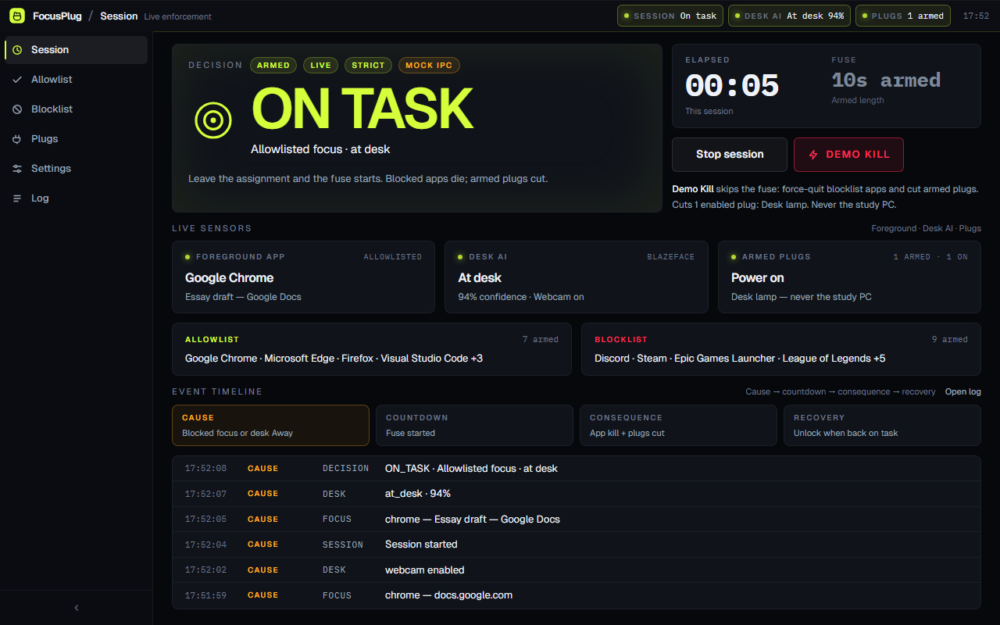
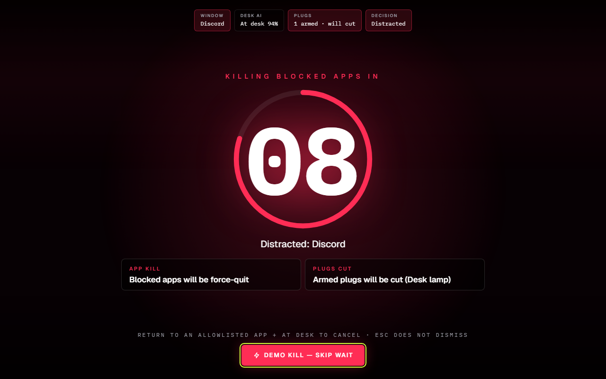
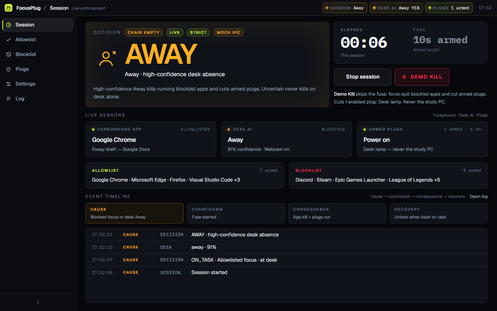
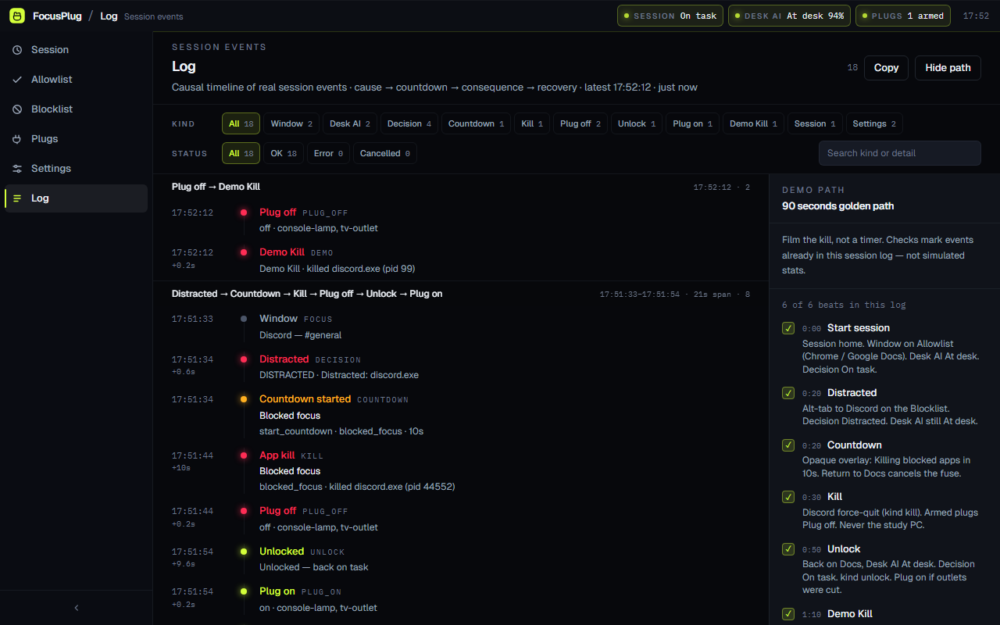
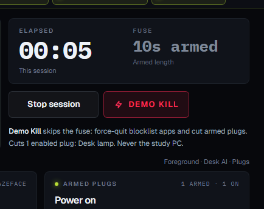

# FocusPlug demo script (2–3 min)

**Target: 2:30. Band: 2:00–3:00.** One take, Windows desktop, webcam on. This is an **enforcement** film, not a timer walkthrough.

Say this once, out loud, before record: *“AI decides at-desk vs away; the kill is the consequence.”*

Do **not** say: Pomodoro, focus timer, streak, gentle reminder, productivity coach, tutor.

## Pre-flight (not on camera)

1. Discord installed and signed in. Google Docs open in Chrome (`docs.google.com` in the title).
2. `npm run dev` (or packaged build). Confirm the UI is live IPC, not a stuck mock.
3. **Settings:** Countdown **10s**, Strict mode **on**, Desk AI webcam **on**, desk threshold default (~60%).
4. **Allowlist** includes Chrome / Google Docs. **Blocklist** includes Discord.
5. Sit in frame until session home shows Desk AI **At desk** with a real confidence (not 0%).
6. Close extra windows. Hide this script. Have a second take ready with **Demo Kill**.

If Discord cannot launch, skip to the Demo Kill beat after the overlay preview (`Settings` → **Preview kill overlay**) and say you are showing the fuse + instant kill path.

## Clock

| Time | Beat | On screen | Voice (tight) |
| --- | --- | --- | --- |
| 0:00–0:15 | Problem | Session home, session **off**, Docs visible in the background | “Students fake-study with Discord open. Timers count minutes. They don’t close the distraction, and they don’t know if you left the chair.” |
| 0:15–0:35 | Setup | Click **Allowlist** (Chrome/Docs), **Blocklist** (Discord), **Settings** (webcam on, strict on). Back to **Session** | “FocusPlug is a local enforcer. Allowlist the assignment. Blocklist Discord and games. Desk AI runs on-device — frames never leave this PC.” |
| 0:35–0:50 | Arm | Sit in frame. Click **Start session**. Decision **On task**. Point at Window + Desk AI + Decision | “Session on. Chrome on the assignment, I’m at the desk — On task. Session off would only observe. Live session can kill.” |
| 0:50–1:20 | Distracted | Alt-tab to Discord. Opaque overlay: **Killing blocked apps in** `10…`. Window, Desk AI, and Plugs still read under the countdown | “I tabbed to Discord. That’s Distracted. Ten-second fuse. If I go back to Docs, this cancels. I’m not going back.” |
| 1:20–1:40 | Kill + log | Overlay hits 0; Discord quits. Open **Log**: `start_countdown`, `kill` | “Discord is gone. The log is the proof, not a toast.” |
| 1:40–1:55 | Unlock | Alt-tab to Docs, stay in frame. Overlay gone. Decision **On task** | “Back on Docs, still at the desk — unlocked. Strict mode needs both.” |
| 1:55–2:20 | Desk AI (load-bearing) | Re-open Discord in the background if needed, then **cover the webcam** or leave the chair. Decision **Away**. Blocklist apps quit after the fuse | “Timers can’t see this. I left the desk — or covered the camera. High-confidence Away kills blocklist apps even if they weren’t focused. Uncertain never kills on desk alone.” |
| 2:20–2:35 | Demo Kill | Uncover camera. Open Discord again. Click red **Demo Kill** on the fuse plate (or overlay **Demo Kill, skip wait**) | “Demo Kill is for filming: same force-quit, no waiting. Never kills the study PC.” |
| 2:35–2:50 | Close | Session home: Decision + Desk AI visible | “AI decides at-desk vs away. The kill is the consequence. FocusPlug — local enforcement, not another focus timer.” |

If the desk-away beat is messy, cut it to 10 seconds (cover lens → **Away** label) and spend the time on Demo Kill. **Do not** skip Desk AI entirely — Hyperbloom scores AI/ML as central, not decorative.

## Still captures (placeholders)

Save PNGs at the paths below (create `docs/screenshots/` when filming). Freeze the overlay with `#/?scene=distracted&countdown=8&freeze=1` only for stills, not the live take. Broken images here are slots, not missing product.

| File | When to grab | Judge should read |
| --- | --- | --- |
| `01-on-task.png` | After Start, Docs focused, at desk | Enforcement is armed; AI says present |
| `02-kill-overlay.png` | Overlay at ~8s, Discord focused | Consequence is unmistakable |
| `03-desk-away.png` | Covered lens / left frame | Presence is a kill input |
| `04-session-log.png` | After kill + unlock | `kill` / `unlock` are real events |
| `05-demo-kill.png` | Fuse plate **Demo Kill** in frame | Reliable demo path |

## Hard fails (reshoot)

- Overlay is a small toast instead of a full-window takeover
- Countdown stuck at 10 and Discord never dies
- You call it a timer or “productivity app”
- Desk AI stays **At desk** with the lens covered
- Demo Kill no-ops or claims the killer isn’t wired
- Study browser / VS Code / Docs gets killed
- You spend the minute on settings sliders instead of a kill

## Shot order if time is short (2:00 cut)

Problem (10s) → Start On task (10s) → Discord overlay (25s) → kill (10s) → return unlock (10s) → cover-camera Away (15s) → Demo Kill (10s) → close line (10s).
