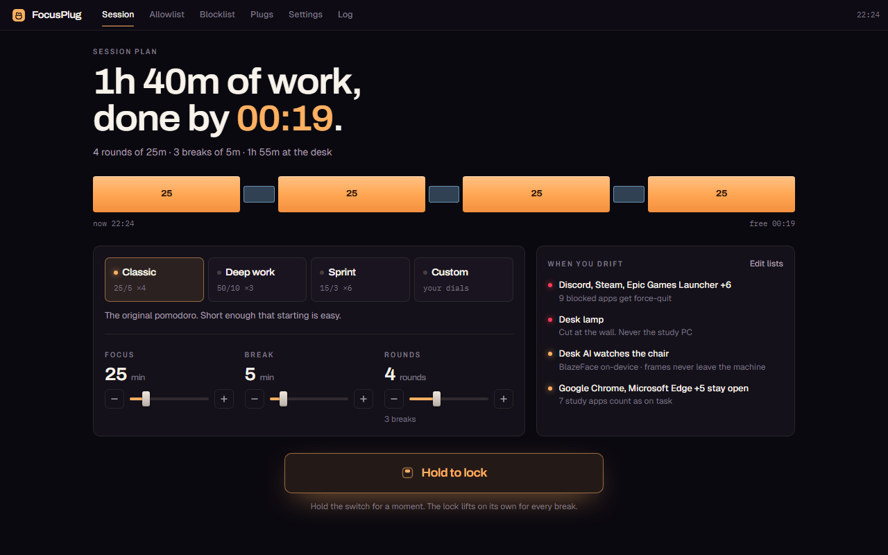
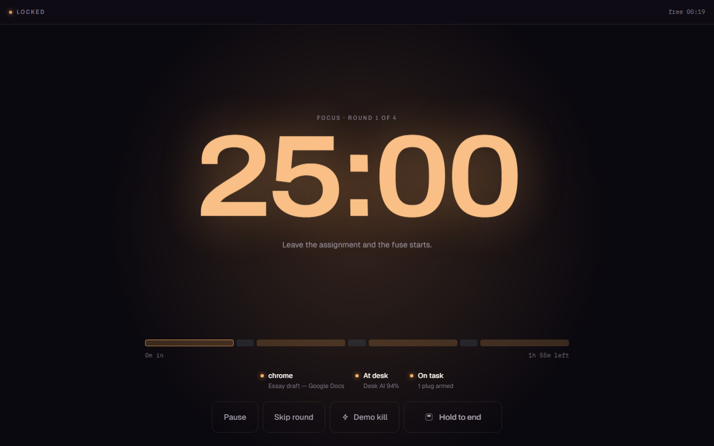
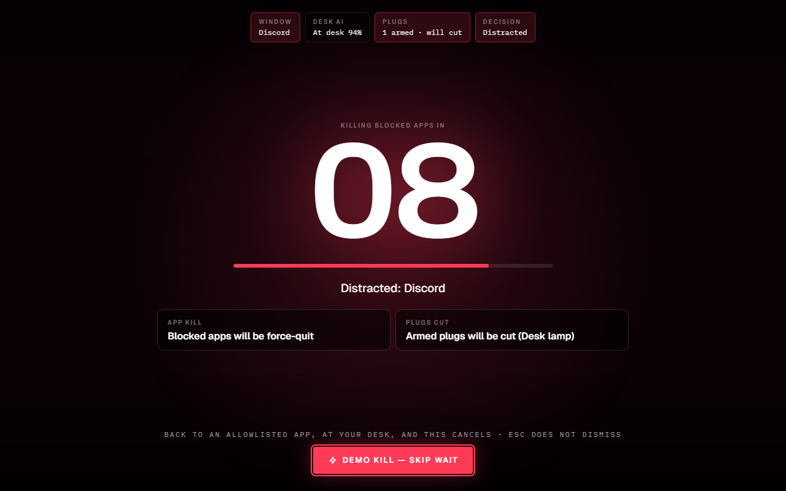
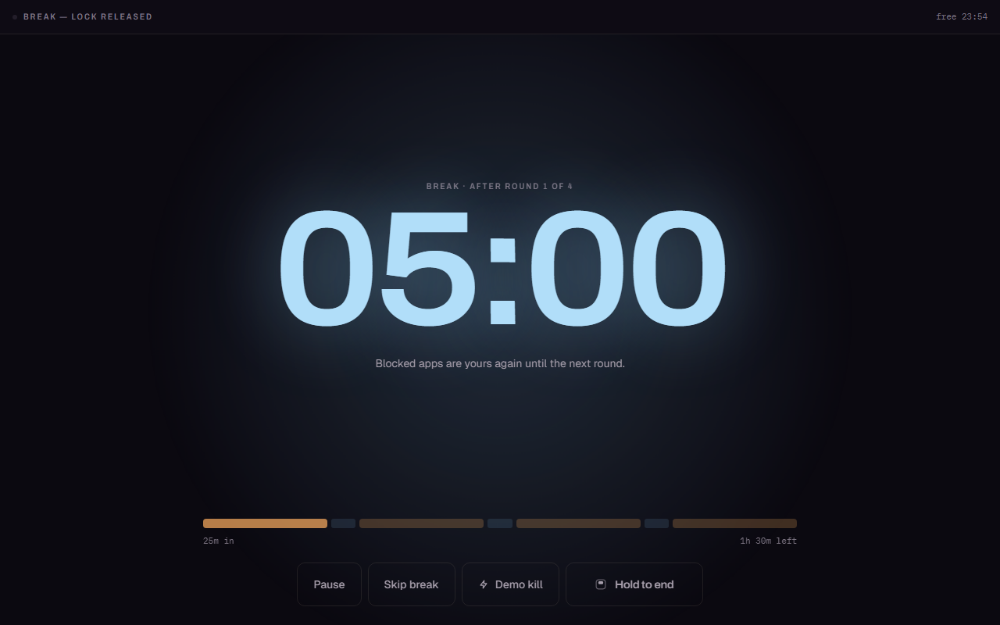
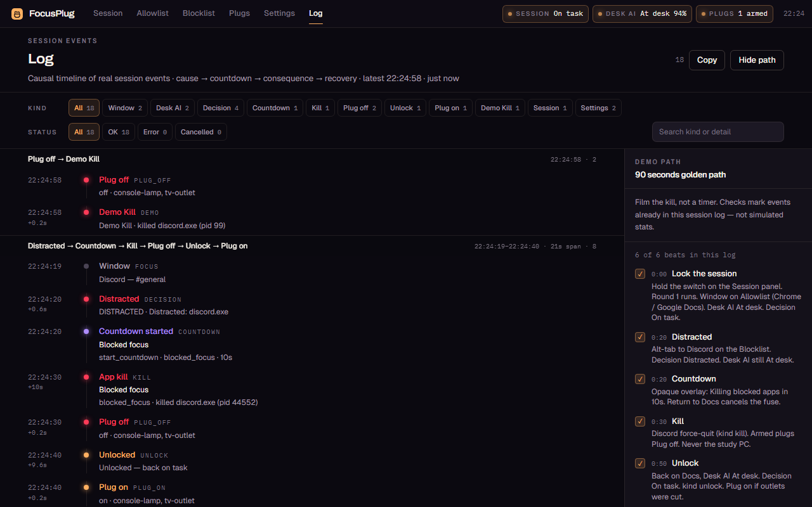

# FocusPlug demo script (2–3 min)

**Target: 2:30. Band: 2:00–3:00.** One take, Windows desktop, webcam on. It is a pomodoro — film the **enforcement**, not the timer.

Say this once, out loud, before record: *“Every other pomodoro asks you to keep it. AI decides at-desk vs away, and the kill is how this one keeps it for you.”*

Do **not** say: streak, gentle reminder, nudge, productivity coach, tutor. Never pitch the countdown on its own — always land the consequence in the same breath.

## Pre-flight (not on camera)

1. Discord installed and signed in. Google Docs open in Chrome (`docs.google.com` in the title).
2. `npm run probe:golden` — 10 seconds, no GUI, kills nothing. It must print **GOLDEN PATH PROBE: PASS**; if the window sensor is dead on this machine, everything below is unfilmable.
3. `npm run dev` (or packaged build). Confirm the UI is live IPC, not a stuck mock — the sensor line in lock mode must name your real window once a round is running.
4. **Settings:** Countdown **10s**, Strict mode **on**, Desk AI webcam **on**, desk threshold default (~60%).
5. **Allowlist** includes Chrome / Google Docs. **Blocklist** includes Discord.
6. On the **Session** panel pick **Sprint** (15/3) so a round fits the film, hold the switch into lock mode, and sit in frame until the sensor line reads **At desk** with a real confidence (not 0%). Sensors read **Standby** until a round is running. Hold **End** to come back out before you record.
7. Close extra windows. Hide this script. Have a second take ready with **Demo Kill**.

If Discord cannot launch, skip to the Demo Kill beat after the overlay preview (`Settings` → **Preview kill overlay**) and say you are showing the fuse + instant kill path. Still open **Log** for two seconds so the timeline is on film.

The Log page **90s path** panel is a cheat sheet of this script (same product labels). Do not read it aloud — point at Kill / Unlock rows if a judge asks where the proof lives.

## Clock

| Time | Beat | On screen | Voice (tight) |
| --- | --- | --- | --- |
| 0:00–0:15 | Problem | Session panel, nothing locked, Docs visible in the background | “Students fake-study with Discord open. A pomodoro counts the minutes and then dings. It doesn’t close the distraction, and it has no idea you left the chair.” |
| 0:15–0:35 | Setup | On **Session**, pick a shape and drag the dials — the ribbon and the “done by” time follow. Show **Blocklist** (Discord), **Settings** (webcam on, strict on), back to **Session** | “Pick the shape: four rounds of twenty-five, breaks in between, free by ten. Allowlist the assignment, blocklist Discord and the games. Desk AI runs on-device — frames never leave this PC.” |
| 0:35–0:50 | Arm | Sit in frame. **Hold the switch.** Lock mode takes the screen: round 1, the readout counting, sensor line **On task** | “Hold it — and that’s the commitment. Round one is live. Chrome on the assignment, I’m at the desk. Off the clock it only observes; a live round can kill.” |
| 0:50–1:20 | Distracted | Alt-tab to Discord. Opaque overlay: **Killing blocked apps in** `10…`. HUD chips still show Window / Desk AI / Decision | “I tabbed to Discord. That’s Distracted. Ten-second fuse. If I go back to Docs, this cancels. I’m not going back.” |
| 1:20–1:40 | Kill + log | Overlay hits 0; Discord quits. Hold **End**, open **Log**: causal chain Window → Distracted → **Countdown** → **Kill** (and **Plug off** if a fun outlet was armed) | “Discord is gone. The log is the proof — sensor, Decision, fuse, then kill. Same labels as the overlay.” |
| 1:40–1:55 | Unlock | Alt-tab to Docs, stay in frame. Overlay gone. Decision **On task** | “Back on Docs, still at the desk — unlocked. Strict mode needs both.” |
| 1:55–2:20 | Desk AI (load-bearing) | Re-open Discord in the background if needed, then **cover the webcam** or leave the chair. Decision **Away**. Blocklist apps quit after the fuse | “Timers can’t see this. I left the desk — or covered the camera. High-confidence Away kills blocklist apps even if they weren’t focused. Uncertain never kills on desk alone.” |
| 2:20–2:35 | Demo Kill | Uncover camera. Open Discord again. Click **Demo kill** in the lock-mode controls (or the overlay’s **Demo Kill — skip wait**) | “Demo Kill is for filming: same force-quit, no waiting. Never kills the study PC.” |
| 2:35–2:50 | Close | **Skip round** into a break — the screen turns daylight, lock released | “The break hands Discord back on its own, then round two takes it away again. AI decides at-desk vs away. The kill is what makes the timer mean something.” |

If the desk-away beat is messy, cut it to 10 seconds (cover lens → **Away** label) and spend the time on Demo Kill. **Do not** skip Desk AI entirely — Hyperbloom scores AI/ML as central, not decorative.

## Still captures

`docs/screenshots/` is committed and regenerates from the seeded scenes:

```bash
npm run preview:renderer   # terminal 1
npm run stills:readme      # terminal 2
```

Those are mock-IPC renders of the real UI — good enough for the README, but **overwrite them with live captures from the take** if the run goes well. Freeze the overlay with `#/?scene=distracted&countdown=8&freeze=1` only for stills, not the live take. For the log still, `#/log?scene=golden` seeds a full causal chain on mock IPC; the live take should use the real log after Discord dies.

| File | When to grab | Judge should read |
| --- | --- | --- |
| `01-session-plan.png` | Panel before you lock | The commitment is legible: shape, dials, ribbon, the hour you are free |
| `02-lock-focus.png` | Round running, Docs focused, at desk | Enforcement is armed; AI says present |
| `03-kill-overlay.png` | Overlay at ~8s, Discord focused | Consequence is unmistakable, and it names what dies |
| `04-break-released.png` | First break | The lock lifts on its own — daylight instead of tungsten |
| `05-session-log.png` | After kill + unlock | Causal timeline: `countdown` → `kill` → `unlock` (and `plug_off` / `plug_on` if armed). Kind/status filters |











## Hard fails (reshoot)

- Overlay is a small toast instead of a full-window takeover
- Countdown stuck at 10 and Discord never dies
- You pitch the countdown without the kill in the same breath
- Desk AI stays **At desk** with the lens covered
- Demo Kill no-ops or claims the killer isn’t wired
- Study browser / VS Code / Docs gets killed
- You spend the minute on settings sliders instead of a kill

## Shot order if time is short (2:00 cut)

Problem (10s) → hold-to-lock, On task (10s) → Discord overlay (25s) → kill (10s) → return unlock (10s) → cover-camera Away (15s) → Demo Kill (10s) → break turns daylight + close line (10s).
